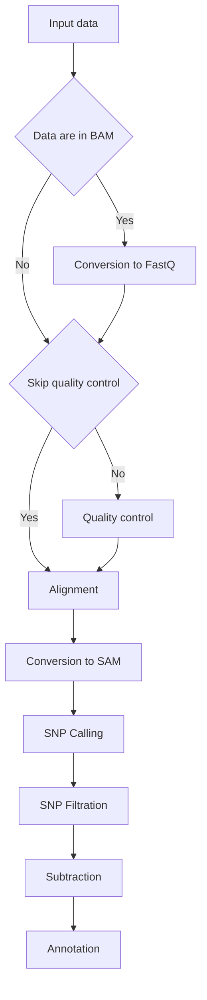

AraMAP
=========

Forward genetics in combination with whole genome sequencing method is a powerful approach to associate phenotype with the causal mutation to the single nucleotide precision. Lack of easy to use tool to analyze mapping data impart hurdles in wide scale adoption of forward genetic screens. We developed this tool:  an easy to use software with graphical user interface to assist biologist in identifying causal mutation without any bioinformatics expertise. ArtinDNA can efficiently identify both dominant and recessive mutations from backcrossed, outcrossed, M2 single or pooled population of mutatnts. ArtinDNA runs on Windows, MAC or Linux platform. It can analyze both short and long single/paired end reads in either BAM or FASTQ format. Currently, ArtinDNA can identify EMS induced mutations in Arabidopsis however it has a potential to be adopted to any species with well annotated genomic resources. We believe, ArtinDNA will push forward genetic screen as a routinely used approach  to identify biological functions of the gene.

# Requirements

You can use our [Docker](https://www.docker.com/) where all the tools are already integrated. You can find it [here](https://hub.docker.com/r/javorka/artin-dna/).  :blush:

In order to run this application you need to following requirements:
 - Internet connection
 - [Bedtools](http://bedtools.readthedocs.io/) 
 - [Trim Galore!](https://www.bioinformatics.babraham.ac.uk/projects/trim_galore/)
 - [BWA](http://bio-bwa.sourceforge.net/)
 - [Samtools + BCFtools](http://www.htslib.org/)
 - [SnpEff](http://snpeff.sourceforge.net/)

> Note: You can install all of them relatively easy using [bioconda](https://bioconda.github.io/)

## Environment variables

In order to using the tool you **must** set following `ENVIRONMENT_VARIABLES`
 - `REFERENCE_GENOME` 
 -- name of genome used by the `snpEff`
 -- for example __Arabidopsis_thaliana__
 - `REFERENCE_GENOME_DIR`
 -- path to the directory where the genome is stored
 -- genome should be in the FASTA format.
 -- used by the `BWA`
 -- **directory must contains file  `REFERENCE_GENOME.fa`**
 -- for example __/home/user__ which contains file __Arabidopsis_thaliana.fa__

## Data flow

